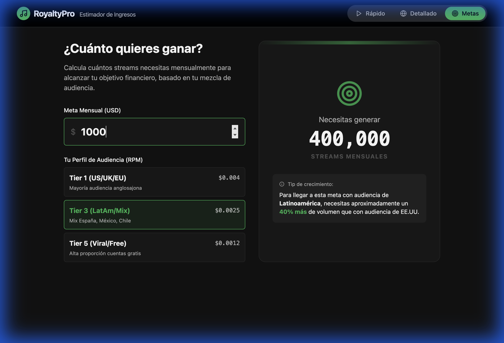

# RoyaltyPro: Calculadora de Royalties Musicales

**RoyaltyPro** es un estimador de ingresos diseñado específicamente para el ecosistema del **Music Business**. Permite a artistas, sellos discográficos, managers y cantantes proyectar sus ganancias por streaming de manera rápida, precisa y profesional.





## 🎵 ¿Para qué sirve este proyecto?

En la industria musical actual, entender cuánto dinero genera tu música en plataformas como Spotify, Apple Music o Tidal puede ser confuso debido a las variaciones de pago por país (Tiers). 

**RoyaltyPro** soluciona esto permitiéndote:
- **Calcular ganancias por país**: Diferencia ingresos entre mercados de alto valor (EE.UU., UK) y mercados de volumen (LatAm).
- **Establecer Metas Financieras**: ¿Quieres ganar $1,000 USD al mes? Nuestra herramienta te dice exactamente cuántos streams necesitas según tu audiencia.
- **Análisis de RPM**: Visualiza tu "Ingreso por cada mil reproducciones" efectivo.

## 🚀 Ficha Técnica

Este proyecto utiliza tecnologías de vanguardia para garantizar precisión financiera y una experiencia de usuario fluida.

- **Frontend**: [React.js](https://reactjs.org/) con Custom Hooks para gestión de estado complejo.
- **Precisión Financiera**: [currency.js](https://currency.js.org/) para evitar errores aritméticos de coma flotante en cálculos monetarios.
- **Validación de Datos**: [Zod](https://zod.dev/) para asegurar la integridad de los datos de entrada.
- **Persistencia**: `localStorage` para autoguardado de progreso entre sesiones y cambios de vista.
- **Estilos**: [Tailwind CSS](https://tailwindcss.com/) (Diseño "Dark Mode" premium inspirado en Spotify).
- **Gráficos**: [Recharts](https://recharts.org/) (Distribución de ingresos interactiva).
- **Herramienta de Construcción**: [Vite](https://vitejs.dev/).

## 🛠️ Características Principales

1. **Modo Detallado con Persistencia**: Desglose por país con autoguardado en tiempo real. No pierdes tus datos al recargar o cambiar de pestaña.
2. **Selector Masivo de Países**: Interfaz optimizada para añadir múltiples territorios simultáneamente.
3. **Modales Premium**: Sistema de confirmación personalizado para una navegación coherente y profesional.
4. **Cálculos de Alta Precisión**: Motor de cálculo robusto que maneja streams y tasas variables con decimales exactos.
5. **Planificador de Metas**: Define objetivos en dólares y descubre cuántos streams necesitas en cada mercado.

## 📦 Instalación y Uso Local

Si eres desarrollador y quieres correr este proyecto localmente:

1. Clona el repositorio:
   ```bash
   git clone https://github.com/JhonDavid930/Calculadora_De_Royalties.git
   ```
2. Instala las dependencias:
   ```bash
   npm install
   ```
3. Inicia el servidor de desarrollo:
   ```bash
   npm run dev
   ```
4. Abre `http://localhost:5173` en tu navegador.

---
Desarrollado para potenciar la transparencia en los ingresos de la industria musical. 🎧✨
