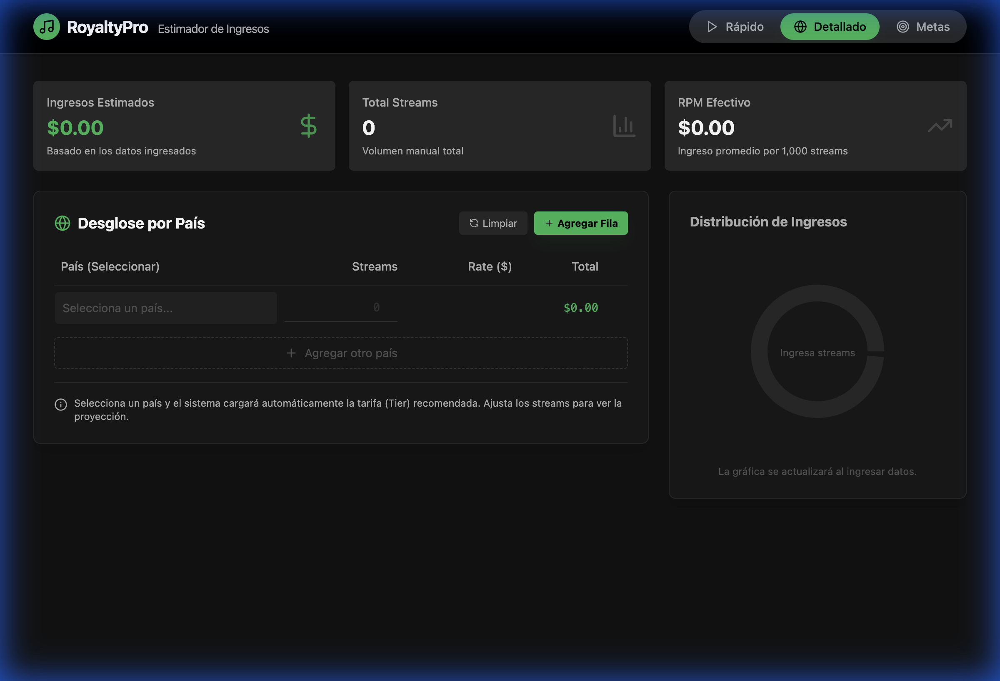

# RoyaltyPro: Calculadora de Royalties Musicales

**RoyaltyPro** es un estimador de ingresos diseñado específicamente para el ecosistema del **Music Business**. Permite a artistas, sellos discográficos, managers y cantantes proyectar sus ganancias por streaming de manera rápida, precisa y profesional.




## 🎵 ¿Para qué sirve este proyecto?

En la industria musical actual, entender cuánto dinero genera tu música en plataformas como Spotify, Apple Music o Tidal puede ser confuso debido a las variaciones de pago por país (Tiers). 

**RoyaltyPro** soluciona esto permitiéndote:
- **Calcular ganancias por país**: Diferencia ingresos entre mercados de alto valor (EE.UU., UK) y mercados de volumen (LatAm).
- **Establecer Metas Financieras**: ¿Quieres ganar $1,000 USD al mes? Nuestra herramienta te dice exactamente cuántos streams necesitas según tu audiencia.
- **Análisis de RPM**: Visualiza tu "Ingreso por cada mil reproducciones" efectivo.

## 🚀 Ficha Técnica

Este proyecto ha sido desarrollado con tecnologías modernas para garantizar velocidad y una experiencia de usuario premium.

- **Frontend**: [React.js](https://reactjs.org/) (Hooks, UseMemo para cálculos en tiempo real).
- **Estilos**: [Tailwind CSS](https://tailwindcss.com/) (Diseño "Dark Mode" inspirado en plataformas de streaming).
- **Gráficos**: [Recharts](https://recharts.org/) (Visualización interactiva de distribución de ingresos).
- **Iconos**: [Lucide React](https://lucide.dev/).
- **Herramienta de Construcción**: [Vite](https://vitejs.dev/) para una carga ultra rápida.

## 🛠️ Características Principales

1. **Modo Rápido**: Ingresa un número total de streams y obtén una cifra global instantánea.
2. **Modo Detallado**: Desglose país por país usando una base de datos interna de tarifas por territorio (Tier 1 a Tier 5).
3. **Planificador de Metas**: Define un objetivo en dólares y el sistema calcula el tráfico necesario.
4. **Visualización de Datos**: Gráficos circulares que muestran qué países están generando mayor rentabilidad en tu catálogo.

## 📦 Instalación y Uso Local

Si eres desarrollador y quieres correr este proyecto localmente:

1. Clona el repositorio:
   ```bash
   git clone https://github.com/JhonDavid930/Calculadora_De_Royalties.git
   ```
2. Instala las dependencias:
   ```bash
   npm install
   ```
3. Inicia el servidor de desarrollo:
   ```bash
   npm run dev
   ```
4. Abre `http://localhost:5173` en tu navegador.

---
Desarrollado para potenciar la transparencia en los ingresos de la industria musical. 🎧✨
